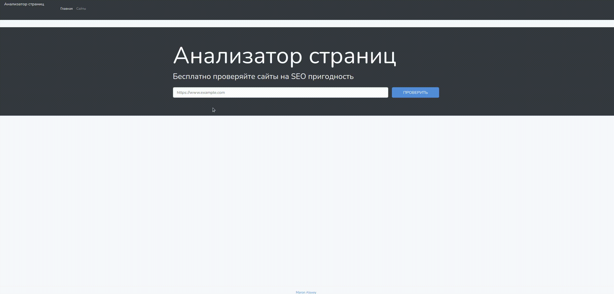

<h1 align="center">page-seo-analyzer</h1>  
<h3 align="center">

</h3>

### [live](https://page-analaizer.herokuapp.com/)

### Description

It's my third practice work on Hexlet.

Page Analyzer is a small web application, based on laravel

### How to use

### While doing this project, I got to know:

- **Laravel**
- **Testing**
- **Deploy on Heroku**
- **Routing**
- **Validating**
- **Carbon**
- **Bootstrap**
- **Query Builder**
- **Flash Messages**
- **PostgreSQL**
- **DiDOM**
